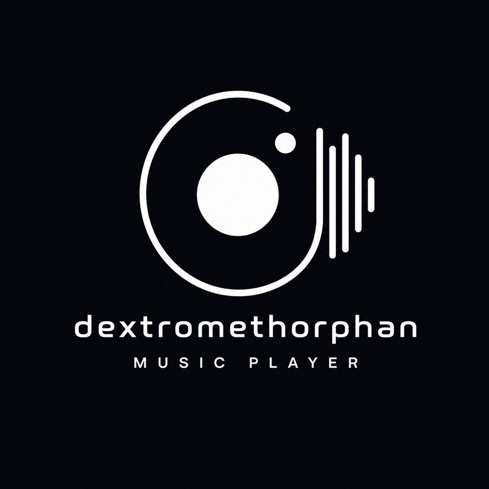
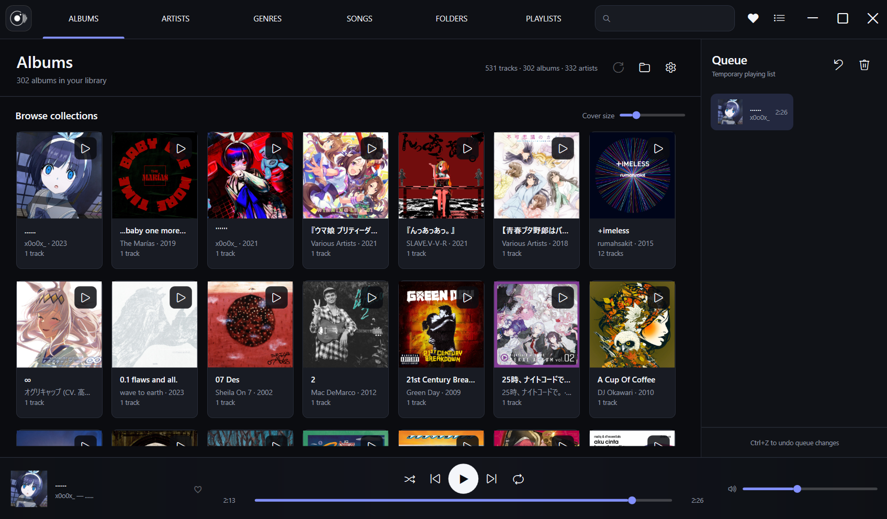
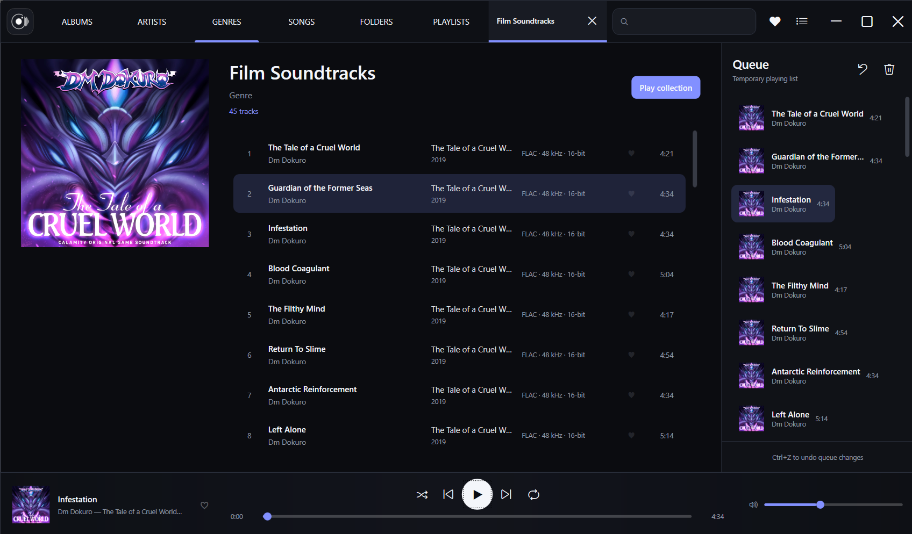

<p align="center">
  
</p>

<p align="center">
  A fast, offline-first music player built for Windows.<br>
  Native playback, a focused library, synced lyrics, and no telemetry.
</p>

<p align="center">
  <strong>Windows 10/11</strong> · <strong>WPF</strong> · <strong>.NET 10</strong> · <strong>SQLite</strong> · <strong>WASAPI</strong>
</p>

> [!NOTE]
> Dextromethorphan is under active development. The core player is usable, but settings, audio-device behavior, and parts of the interface may still change.

## What it looks like

### Your library

Square artwork, quick navigation, a persistent player, and an editable queue—without a spreadsheet-style track grid.



### Collections and queue

Open any album, artist, genre, or folder in its own tab, then play individual tracks or send the full collection to the queue.



## Highlights

- **Windows-native audio** — event-driven WASAPI shared and exclusive modes, per-device profiles, gapless playback, crossfade, ReplayGain, speed control, and DSD over PCM (DoP).
- **Offline library** — local folders, mounted drives, and SMB/UNC paths are scanned into a fast SQLite library with file watching and cached artwork.
- **Flexible browsing** — albums, artists, genres, songs, folders, playlists, favorites, and fast full-library search.
- **Modern playback flow** — temporary queue, drag reordering, undo/redo, shuffle, repeat, bookmarks, sleep timer, and Spotify-style previous-track behavior.
- **Lyrics that belong in the player** — static, LRC, and enhanced-LRC lyrics with line and word timing, automatic scrolling, and click-to-seek.
- **Desktop integration** — rebindable shortcuts, media keys, Windows media controls, session restore, and an audio diagnostics panel.

## Run it from source

You need Windows 10 version 2004 or newer and the [.NET 10 SDK](https://dotnet.microsoft.com/download/dotnet/10.0).

```powershell
git clone https://github.com/moonnomi/Dextromethorphan.git
cd Dextromethorphan
dotnet restore Dextromethorphan.slnx
dotnet run --project src/Dextromethorphan.App
```

On first launch, select **Add music folder**. Your library, settings, and cache live in `%APPDATA%\Dextromethorphan`.

## Audio support

Dextromethorphan has separate direct and DSP playback paths. Exclusive WASAPI without DSP can bypass the Windows shared mixer; enabling software volume, ReplayGain, crossfade, fades, or speed processing intentionally uses the DSP path instead.

Managed decoders handle FLAC and Ogg Vorbis. WAV, AIFF, and MP3 use native NAudio paths, while AAC, ALAC, M4A, WMA, and Opus use Windows Media Foundation where a platform decoder is available. Uncompressed DSF and DFF can be streamed as DoP to compatible hardware.

For the exact mode and fallback rules, see [Audio](docs/AUDIO.md).

## Build and test

```powershell
dotnet test Dextromethorphan.slnx
./scripts/build-release.ps1 -Runtime win-x64 -SelfContained
```

Add `-Installer` when [Inno Setup 6](https://jrsoftware.org/isinfo.php) is installed.

## Documentation

- [Audio engine and playback modes](docs/AUDIO.md)
- [Library, scanning, and playlists](docs/LIBRARY.md)
- [Interface and navigation](docs/UI.md)
- [Windows shortcuts and media controls](docs/WINDOWS-INTEGRATION.md)
- [Project architecture](docs/ARCHITECTURE.md)

## Project status

The current focus is playback reliability, audio diagnostics, and interaction polish. Bug reports and focused pull requests are welcome through [GitHub Issues](https://github.com/moonnomi/Dextromethorphan/issues).

<details>
<summary>Third-party software and licenses</summary>

NAudio and NVorbis are MIT licensed; BunLabs.NAudio.Flac is MS-PL; Microsoft.Data.Sqlite is MIT; SQLitePCLRaw is Apache-2.0; and TagLibSharp is LGPL-2.1. Replace `ITrackMetadataReader` and the managed FLAC adapter if a permissive-only distribution policy is required.

</details>
